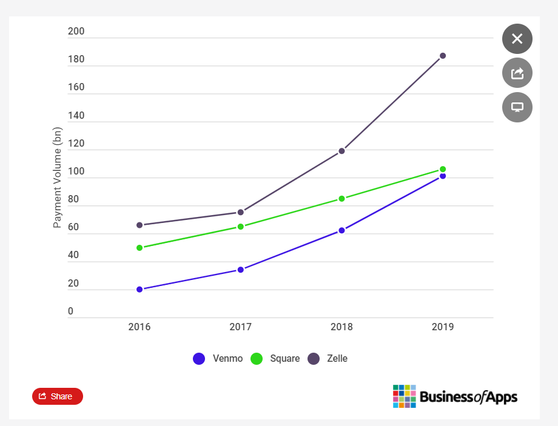

# Homework-1

# Zelle - P2P Digital payment platform

## Overview and Origin 

The peer-to-peer digital payment market is booming. Zelle is one of them. Zelle allows its customers to send and receive money through their own bank’s website and apps and Zelle’s mobile app. Zelle’s free and fast services make it stand out in the digital payment domine. The service offers person-to-person (P2P), business-to-consumer (B2C), and government-to-consumer (G2C)payments. 

* When was the company incorporated? Who are the founders of the company?

Zelle was launched in 2017, formerly known as ClearXchange. It was formerly owned by serval big banks such as Bank of America, Chase, and Wells Fargo. Bank customers can receive and make payments directly between banks. In 2016 clearXchange was sold to Early Warning Services which was also owned by banks such as Captial One & US bank.  In 2017, Early Warning Services released Zelle payment system and mobile app. 

Mike Kennedy is the creator of the P2P payment network Zelle. He is currently the CEO of another blockchain and digital currency payment technology company, Interstellar. Zelle’s current CEO is Albert Ko.

## Business Activities:

* What specific financial problem is the company or project trying to solve?

While the P2P technology is booming, so did scammers. They try to trick consumers into sending money via payment apps.  Zelle services have received negative publicity due to fraud. To transfer money from Zelle, the sender needs to have the receiver's email and phone number if the sender transfer money to an unknown person once the transaction is complete. To reverse the transaction almost impossible since the sender gave the authorization for the transaction. The sender's bank is not liable for fraudulent transactions. Since then, Zelle's website has warned customers only to send money that they trust and verify the receiver's information before sending out the fund.  

* Which technologies are they currently using, and how are they implementing them? (This may take a little bit of sleuthing–– you may want to search the company’s engineering blog or use sites like Stackshare to find this information.)

Zelle is backed up by Early Warning Service, LLC., It is a Fitech company that focus on payment and risk management solutions. It’s the owner and operator of Zelle Network. Zelle’s technology partners are ACI universal payments; CGI; DB banking technology & IBM. 

From Stack share Zelle use the following technologies to allow their system to operate:

** Application and Data: CloudFlare-Content Delivery network

** Utilities: 1. Google analytics-General Analytics 
	   2. Google Tag Manager-Analytics Integrator  

**DevOps :  1.New Relic- Performance monitoring 
	    2.Varnish-Web Cache

** Businesses Tools: 1. Drupal-Self-Hosted Blogging
		     2. Acquia-hosted Blogging Planforms

## Landscape:

* What domain of the financial industry is the company in? What have been the major trends and innovations of this domain over the last 5-10 years?

The domain that Zelle is in is called the Peer-to-peer(P2P) digital payment. Digital payment has become super popular as consumers get more comfortable sending money to friends, family, and co-workers. It became even more popular amount Younger adults. According to Zelle’s consumer research more than 80% of consumers either use or plan to use P2P services and during the during the Coid-19 pandemic 1/5 of consumers began or planned to use P2P services. 

* What are the other major companies in this domain?

In the digital payment domain, Venmo, PayPal, and Square, apple pay are also in the same field. Unlike Venmo and PayPal. Zelle does not charge any transaction fee if the customers have an in-network U.S bank account. The transactions between bank accounting almost instant since Zelle was associated with nearly 700 financial institutes.  Compared to Venmo and Square, Zelle's customer has to have a bank account or a  debit card tied to a bank account in the U.S and on it platform, Zelle does not accept credit cards or business debit cards.  

## Results

* How is your company performing relative to competitors in the same domain?
What has been the business impact of this company so far?

Compare to Venmo and Cash App, Venmo has been leading the P2P digital domain. You can see the growing trending comparison graph from 2016-2019 below. 

According to Yahoo Finance,  “Zelle closes 2020 with Record $307Billion sent on 1.2 Billion Transactions. Year-over-year growth increased by 62%.” Zelle’s transaction volumes increase by 58%. In 2020 nearly 500 new financial institutions have joined Zelle’s Network. "

## Recommendations

* If you were to advise the company, what products or services would you suggest they offer? 
 
Since Zelle can be only used in the U.S. If Zelle can make its service internationally, I think it will benefit many people and the business. There are tons of international students and businessmen studying and working in the U.S. I was one of them before. Transferring money between countries has become more difficult. It takes a long time and money. Since Zelle has associations with major U.S banks and financial institutions, it should not be difficult to link banks internationally. It will definitely make  Zelle stand out in the P2P digital payment domain and also make International money transfers easily accessible for everyone

* What technologies would this additional product or service utilize?

Thinking of Bitcoins can be trade internationally using blockchain technology and blockchain is being so popular in the financial industry. I believe international money transfer also can use blockchain technology to make money transferring much more secure ad fast.  

## References 

[American Banker](https://www.americanbanker.com/news/zelle-founder-mike-kennedy-to-helm-ripple-rival-interstellar#:~:text=Mike%20Kennedy%2C%20the%20creator%20of,digital%20currency%20payment%20technology%20company.)

[Yahoo Finance](https://finance.yahoo.com/news/paypal-vs-venmo-vs-zelle-120000559.html?guccounter=1&guce_referrer=aHR0cHM6Ly93d3cuYmluZy5jb20v&guce_referrer_sig=AQAAAM1A4jmy8h_kotONymRU8Dql3H18eLSQBLQFjFWft_1JdAkJGzcZLbGMHN1vvsvrwfVbqTJa01FhZCcnwBfyFvx60xUjllDDQgwYFp2c_dW2SFbX_6xaoPCS-xiNdbhZfLV9DXh-oRkaA-r4uUcN9KKZYHMlRLp6M9v057nsp2l6)
[Zelle pay](https://www.zellepay.com/press-releases/zeller-closes-2020-record-307-billion-sent-12-billion-transactions)

[Wikipedia](https://en.wikipedia.org/wiki/Zelle_(payment_service))

[Here's An Area Of Digital Payments That's Booming: P2P Payments](forbes.com)

[How Big Banks Agreed to Co-Invest in Zelle](https://www.applicoinc.com/blog/how-traditional-competitors-can-achieve-platform-collaboration/)

[Zelle, the Banks’ Answer to Venmo, Proves Vulnerable to Fraud - The New York Times](https://www.nytimes.com/2018/04/22/business/zelle-banks-fraud.html) 

[Here's An Area Of Digital Payments That's Booming: P2P Payments](https://www.forbes.com/sites/donnafuscaldo/2019/08/23/heres-an-area-of-digital-payments-thats-booming-p2p-payments/?sh=409781ca5677)

[Zelle vs. Cash App vs. Venmo—What’s the Difference?](https://www.firstalliancecu.com/blog/zelle-vs.-cash-app-vs.-venmo-whats-the-difference)

[Venmo Revenue and Usage Statistics](https://www.businessofapps.com/data/venmo-statistics/)

